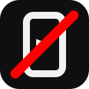
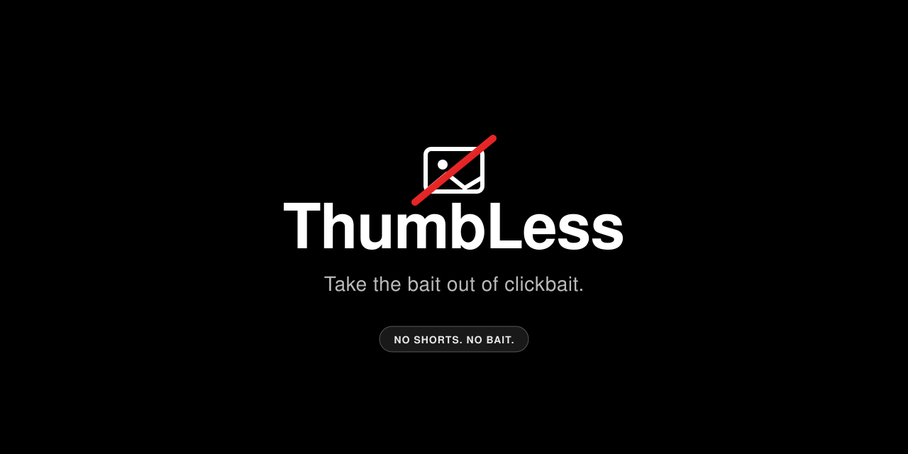
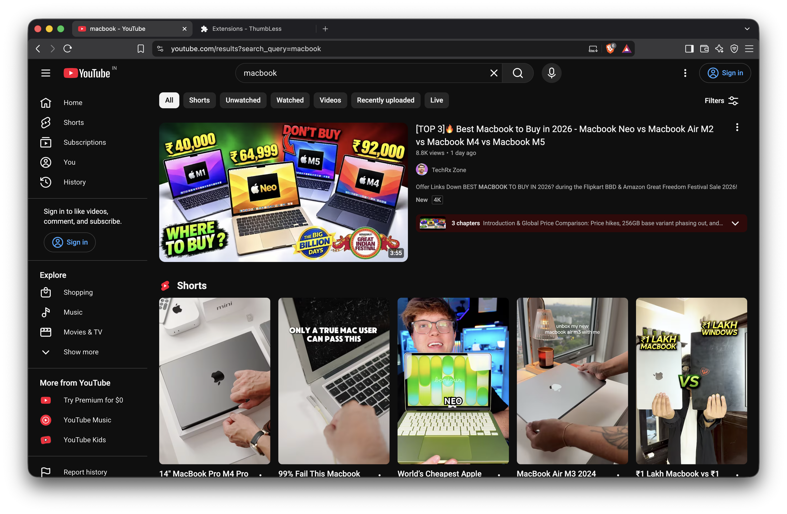
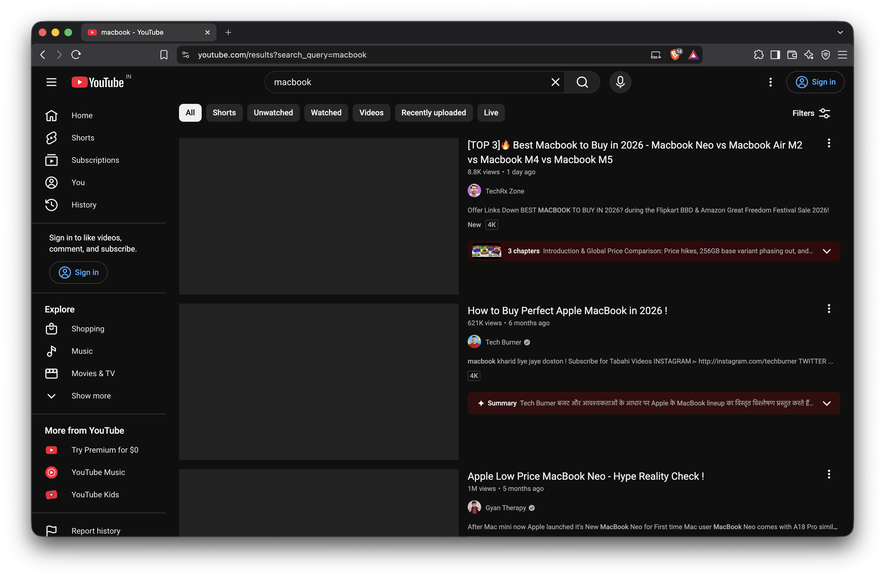
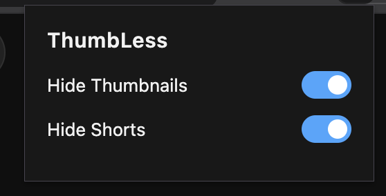

  

  # ThumbLess

  **Take the bait out of clickbait.**  
  A lightweight browser extension that hides YouTube thumbnails and completely eliminates Shorts.

  
  
  
  
  
  

---

## Preview

  

## Install

* [**Chrome Web Store** (Chrome, Brave)](YOUR_CHROME_WEB_STORE_LINK_HERE)
* [**Firefox Add-ons** (Firefox, Zen)](YOUR_FIREFOX_ADDONS_LINK_HERE)

---

## Features

* **Blank Thumbnails:** Replaces all thumbnails with clean gray placeholders while keeping timestamps and overlay buttons fully functional.
* **Remove Shorts:** Completely hides Shorts shelves from the home feed, search results and sidebar.
* **Instant Toggles:** Turn thumbnails or Shorts back on instantly from the popup menu without refreshing the tab.
* **Zero Flicker:** Applies instantly at `document_start` before the DOM renders to prevent layout shifts.
* **Privacy by Design:** Runs entirely on your local device and does not collect or transmit any user data.

---

## Screenshots

| Before (Clickbait Feed) | After (ThumbLess Enabled) |
| :---: | :---: |
|  |  |

  <h3>Settings Popup</h3>
  

---

## Manual Installation (Developer Mode)

### Chrome and Brave

1. Download or clone this repository.
2. Go to `chrome://extensions/` or `brave://extensions/`.
3. Enable **Developer mode** in the top-right corner.
4. Click **Load unpacked** and select the extension directory.

### Firefox and Zen

1. Download or clone this repository.
2. Go to `about:debugging#/runtime/this-firefox`.
3. Click **Load Temporary Add-on...**
4. Select the `manifest.json` file inside the extension folder.

---

## Usage

Once installed, ThumbLess runs automatically on YouTube. Click the extension icon in your browser toolbar to toggle features individually in real time:

* **Hide Thumbnails:** Turn off to reveal video thumbnails.
* **Hide Shorts:** Turn off to bring back YouTube Shorts shelves.

---

## License

This project is licensed under the [MIT License](LICENSE).
